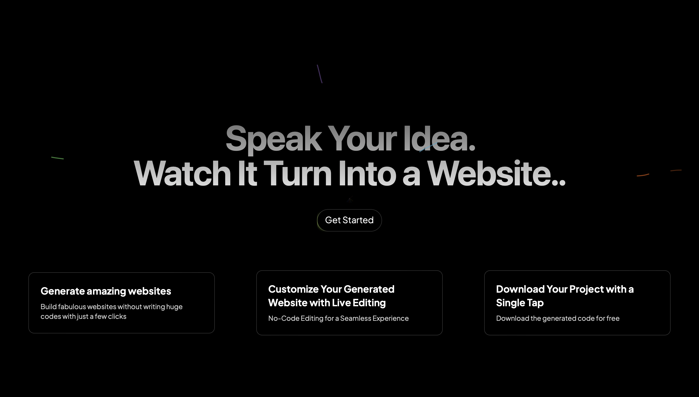
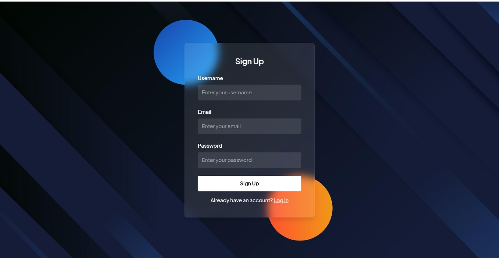
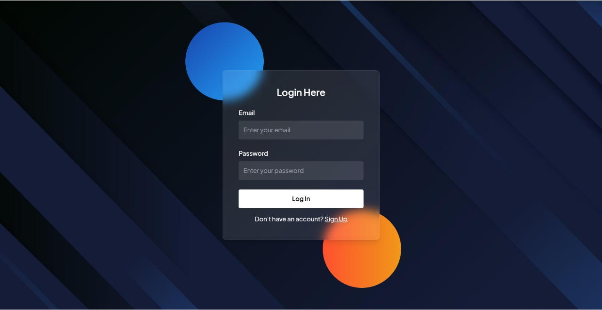
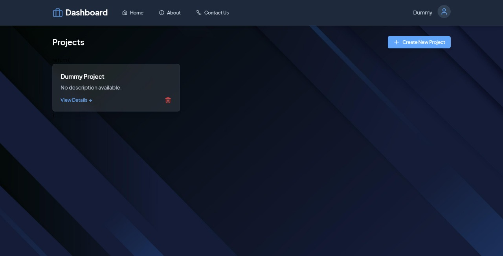
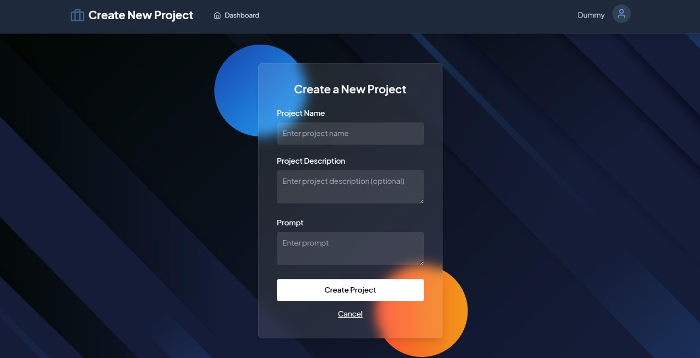
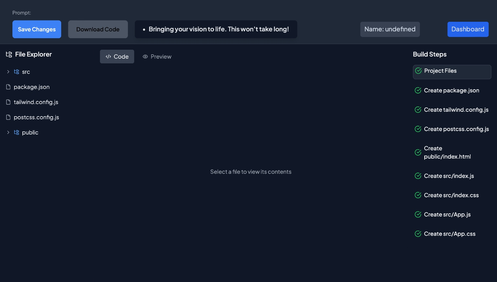

# Text-to-Website generator

AI-Powered Text to Website Generator is an intelligent tool that generates fully functional websites based on natural language prompts. Our website generator is designed for users with little or no coding experience, empowering them to create professional-looking websites effortlessly.Built with React, our platform ensures a seamless and intuitive user experience. The generated websites come with modern UI components, responsive layouts, and optimized code—making website creation effortless for users without technical expertise.

## Description
With intuitive smart automation, and editable features, anyone can build stunning websites tailored to their needs. User-Friendly Interface: Intuitive design with drag-and-drop functionality for easy customization.

AI-Driven Templates: Automatically generated templates based on user input, tailored to various industries and styles.
Responsive Design: Ensures websites look great on all devices, from desktops to mobile phones.

Customizable Components: Includes pre-designed components like headers, footers, galleries, and contact forms that can be easily modified.

Seamless Integration: Supports embedding multimedia, social media links, and third-party tools.
Instant Preview: Real-time preview feature to visualize changes instantly.

Our website builder leverages the power of Machine Learning (ML), specifically a Large Language Model (LLM), to assist users in generating fully functional websites from natural language prompts. This integration allows users to describe their website requirements in simple terms, and the AI intelligently translates those descriptions into structured and responsive web pages.

## Overview

Our AI-powered Text-to-Website Generator transforms simple text prompts into fully functional, professional-looking websites. Designed for users with little to no coding experience, this tool streamlines the website creation process. Whether for personal projects, portfolios, or business websites, our generator ensures a hassle-free experience with stunning results.

## Key Features

1. **Customize Your Generated Website with Live Editing:**

   - No Code Editing for a Seamless Experience .

2. **Download Your Project with a Single Tap:**

   - Download the generated code for free.

3. **Live Preview Option Available:**

   - You can see the live preview of the Webpage you requested.

4. **Dedicated Dashboard with User History :**

   - Once you sign up, every project you create is automatically saved in our secure cloud database. Easily access, manage, and revisit your past projects anytime through a personalized dashboard.

5. **View and Edit Individual Code Files:**

   - Gain full control over your project by viewing and modifying the code for each file directly within the platform.

## Impact on Platform Ideation

Armed with these insights, our platform's ideation phase has been refined to address the specific needs and expectations of college students. Emphasis on detailed project descriptions and multimedia support will be integral, fostering a comprehensive view of showcased projects. Understanding challenges in connecting with peers informs the development of features that promote meaningful collaborations.

As we move forward, these insights will guide the development of a collaborative platform that exceeds the expectations of college students, providing them with a vibrant and supportive space to showcase projects and connect with like-minded individuals.

## Future Updates

 We will consider exploring the following features to enhance the functionality and user experience of generating websites in the future:

1. **Reprompting Implementation:**

   - Integrate reprompting functionality to allow users to iteratively refine and modify the generated website response according to their needs.

2. **Drag and Drop Implementation:**
   - Implement a real-time collaborative drag-and-drop interface that enables seamless website editing, allowing users to adjust elements, navigation menus, fonts, and colors dynamically.

## Design of Pages

Landing Page



SignUp Page



Login Page



Dashboard Page



Prompt Page



Preview Page




## Tech-Stack Used

- [MongoDB](https://www.mongodb.com/) - The database
- [Express.js](https://expressjs.com/) - The web framework
- [React](https://reactjs.org/) - The frontend library
- [Node.js](https://nodejs.org/) - The server environment  
- [Gemini LLM Model using Vertex AI](https://cloud.google.com/vertex-ai) - The LLM Model used
- [Pickle](https://docs.python.org/3/library/pickle.html) - For storing the model variables
   

## Installation

Follow these steps to install and run the project:

### 1. Set Up the Server

Navigate to the server directory and install all dependencies:

```bash
npm i
```

To start the server, run:

```bash
npm run dev
```

### 2. Set Up the Client
Navigate to the client directory and install all dependencies:

```bash
npm i
```

To start the frontend, run:

```bash
npm run dev
```
## Usage

To run the project, follow these steps:

1. Start the server by running the following command inside the server directory:
   
```bash
npm run dev 
```

2. Start the frontend by running the following command inside the client directory:

```bash
npm run dev 
```

The server should now be running on [http://localhost:5001](http://localhost:5001).

The Website should now be running on [http://localhost:5173](http://localhost:5173).
